# KPI Benchmarking & Target Credibility Engine for Green Loans and SLLs

A comprehensive architecture for regulatory-compliant, banker-ready KPI target assessment.

---

## Executive Overview

This system provides **best-available, transparent KPI benchmarking** based on verified peers and science-based references — not false precision. It enables EU banks to assess the ambition and achievability of sustainability-linked loan KPIs while maintaining full auditability.

```mermaid
flowchart TB
    subgraph INPUT["📥 Stage 1: Input & Ingestion"]
        PDF[Borrower PDFs] --> CHUNK[Smart Chunking]
        CHUNK --> VOYAGE[Voyage AI Embeddings]
        VOYAGE --> KB1[(KB-1: Borrower Evidence)]
    end
    
    subgraph RAG["🔍 Stage 2: Document Understanding"]
        KB1 --> EXTRACT[KPI Extraction]
        EXTRACT --> JSON1[Structured JSON + Citations]
    end
    
    subgraph BENCH["📊 Stage 3-4: Benchmarking"]
        SBTI[(KB-3: SBTi SQL DB)] --> PEER[Peer Selection]
        PEER --> PERCENTILE[Percentile Computation]
        PERCENTILE --> AMBITION[Ambition Classification]
    end
    
    subgraph CRED["✅ Stage 5: Credibility"]
        JSON1 --> SIGNALS[Credibility Signals]
        SIGNALS --> ACHIEVE[Achievability Score]
    end
    
    subgraph RISK["⚠️ Stage 6: Risk Context"]
        YAHOO[Yahoo Finance ESG] --> RISKFLAGS[Risk Flags]
    end
    
    subgraph REG["📋 Stage 7: Regulatory"]
        KB2[(KB-2: EU Regulations)] --> COMPLIANCE[Compliance Checklist]
    end
    
    subgraph OUTPUT["📄 Stage 8: Report"]
        AMBITION --> REPORT
        ACHIEVE --> REPORT
        RISKFLAGS --> REPORT
        COMPLIANCE --> REPORT
        REPORT[Banker Report Generator] --> FINAL[JSON + PDF/HTML]
    end
```



---

## User Review Required

> [!IMPORTANT]
> **Design Decisions Requiring Approval:**
> 1. **AI Usage Boundary**: LLMs (Gemini/Perplexity) are strictly limited to document extraction and narrative generation — never for scoring or approval decisions.
> 2. **SBTi Data as Primary Peer Source**: Using the provided SBTi Excel (~35K companies) as the sole peer benchmark source — no web scraping.
> 3. **Confidence Transparency**: All outputs include peer count and confidence level — "best available" framing throughout.

> [!CAUTION]
> **Regulatory Compliance Critical**: This architecture ensures AI models do NOT decide ambition, achievability, or approval. All classifications are deterministic and rule-based.

---

## Architecture Deep Dive

---

## STAGE 1: Input & Ingestion

### Overview
Transform borrower PDFs into embedded, retrievable chunks with full provenance tracking.

#### [NEW] [sbti_data_service.py](file:///c:/Users/Vinayak%20Paka/Desktop/GreenGuard/lma-hackathon/backend/app/services/sbti_data_service.py)

Service to ingest and query SBTi Excel data:

```python
# Key responsibilities:
# - Load companies-excel.xlsx and targets-excel.xlsx into SQL tables
# - Provide sector/scope/geography filtering
# - Compute percentiles for peer groups
# - Return confidence labels based on peer pool size
```

#### [MODIFY] [embedding_service.py](file:///c:/Users/Vinayak%20Paka/Desktop/GreenGuard/lma-hackathon/backend/app/services/embedding_service.py)

Enhance chunking for ESG documents:

```diff
- def chunk_text(self, text: str, chunk_size: int = None, overlap: int = None):
+ def chunk_text(self, text: str, chunk_size: int = None, overlap: int = None, 
+                section_aware: bool = False, document_type: str = "general"):
```

**New Chunking Strategy:**
| Document Section | Chunk Method | Rationale |
|-----------------|--------------|-----------|
| Executive Summary | Page-level | Preserve narrative flow |
| Data Tables | Table-level | Keep figures together |
| KPI Disclosures | Section-level | Maintain context |
| Appendixes | Skip or minimal | Lower relevance |

**Metadata Stored Per Chunk:**
```json
{
  "document_id": 123,
  "document_name": "TechCorp_ESG_Report_2024.pdf",
  "page_number": 15,
  "section_type": "kpi_disclosure",
  "chunk_index": 7,
  "source_type": "borrower_evidence"
}
```

---

## STAGE 2: Document Understanding (RAG)

### Purpose
Extract structured KPI data from borrower documents with full citation traceability.

#### [NEW] [kpi_extraction_service.py](file:///c:/Users/Vinayak%20Paka/Desktop/GreenGuard/lma-hackathon/backend/app/services/kpi_extraction_service.py)

```python
class KPIExtractionService:
    """
    Uses RAG to extract KPI targets, baselines, and governance from documents.
    
    ALLOWED operations:
    - Locate KPI disclosures via semantic search
    - Extract: targets, baselines, years, units, scope
    - Extract governance statements (board oversight, incentives)
    - Extract verification statements (auditor, certification)
    - Return structured JSON with page references
    
    NOT ALLOWED operations:
    - Score or classify ambition
    - Assess achievability or feasibility
    - Recommend approval/rejection
    - Infer data not explicitly stated
    - Generate comparative analysis
    """
```

**Extraction Prompt Template (Structured Output):**
```python
EXTRACTION_PROMPT = """
You are a document extraction assistant. Extract ONLY facts explicitly stated.

Document Context:
{context}

Extract the following if present. If not found, return null.
Respond ONLY with valid JSON:

{
  "kpi_targets": [
    {
      "metric_name": "string",
      "target_value": "number",
      "target_unit": "string", 
      "target_year": "YYYY",
      "scope": "Scope 1|Scope 2|Scope 1+2|Scope 3|Full Value Chain",
      "baseline_value": "number or null",
      "baseline_year": "YYYY or null",
      "evidence_quote": "exact text from document",
      "page_number": "integer"
    }
  ],
  "governance": {
    "board_oversight": "boolean or null",
    "management_incentives": "boolean or null",
    "sustainability_committee": "boolean or null",
    "evidence_quote": "string or null",
    "page_number": "integer or null"
  },
  "verification": {
    "third_party_verified": "boolean or null",
    "verifier_name": "string or null",
    "assurance_level": "limited|reasonable|none or null",
    "evidence_quote": "string or null",
    "page_number": "integer or null"
  },
  "sbti_commitment": {
    "committed": "boolean or null",
    "validation_status": "committed|validated|near-term|net-zero or null",
    "evidence_quote": "string or null",
    "page_number": "integer or null"
  }
}
"""
```

### Three Knowledge Bases Architecture


**Why Separation Matters:**
1. **Audit Trail**: Regulators can verify source of every data point
2. **No Hallucination Risk**: SBTi data queried via SQL, never reasoned over by LLM
3. **Clear Provenance**: Borrower claims vs. external benchmarks vs. regulations

---

## STAGE 3: Peer Benchmarking (NO LLM)

### Database Schema

#### [NEW] [supabase_setup_sbti.sql](file:///c:/Users/Vinayak%20Paka/Desktop/GreenGuard/lma-hackathon/backend/supabase_setup_sbti.sql)

```sql
-- SBTi Companies Reference Table
CREATE TABLE sbti_companies (
    id SERIAL PRIMARY KEY,
    company_name VARCHAR(255) NOT NULL,
    isin VARCHAR(20),
    lei VARCHAR(30),
    location_country VARCHAR(100),
    location_region VARCHAR(100),
    sector VARCHAR(150) NOT NULL,
    status VARCHAR(50), -- Committed, Targets Set, etc.
    target_classification VARCHAR(100),
    near_term_target_year INTEGER,
    near_term_target_scope VARCHAR(50),
    near_term_ambition VARCHAR(100),
    net_zero_committed BOOLEAN,
    net_zero_year INTEGER,
    created_at TIMESTAMP DEFAULT NOW()
);

-- SBTi Targets Detail Table  
CREATE TABLE sbti_targets (
    id SERIAL PRIMARY KEY,
    company_id INTEGER REFERENCES sbti_companies(id),
    target_type VARCHAR(50), -- Near-term, Long-term, Net-Zero
    scope VARCHAR(50), -- Scope 1, Scope 2, Scope 1+2, Scope 3
    coverage_percentage FLOAT,
    reduction_percentage FLOAT,
    base_year INTEGER,
    target_year INTEGER,
    ambition_level VARCHAR(50), -- 1.5°C, Well-below 2°C, 2°C
    methodology VARCHAR(100),
    created_at TIMESTAMP DEFAULT NOW()
);

CREATE INDEX idx_sbti_companies_sector ON sbti_companies(sector);
CREATE INDEX idx_sbti_companies_region ON sbti_companies(location_region);
CREATE INDEX idx_sbti_targets_scope ON sbti_targets(scope);
```

### Peer Selection Logic

```python
class PeerSelectionCriteria:
    """
    Deterministic peer group selection rules.
    """
    
    def select_peers(
        self,
        borrower_sector: str,
        borrower_scope: str,  # "Scope 1+2" or "Scope 3"
        borrower_region: str = None,
        borrower_target_year: int = None,
        year_tolerance: int = 3
    ) -> PeerGroupResult:
        """
        Priority matching levels:
        1. Exact sector + same scope + same region + ±3yr target year
        2. Exact sector + same scope + same region
        3. Exact sector + same scope (any region)
        4. Parent sector + same scope (fallback)
        
        Returns:
        - peer_companies: list of matched companies
        - peer_count: number of peers found
        - match_quality: "exact" | "sector_only" | "broad"
        - confidence_label: "high" | "medium" | "low" | "insufficient"
        """
```

### Percentile Computation

```python
def compute_percentiles(peer_targets: List[float]) -> Dict:
    """
    Deterministic percentile calculation.
    
    Returns:
        {
            "peer_count": 12,
            "min": 10.0,
            "p25": 15.0,
            "median": 21.0,
            "p75": 28.0,
            "max": 45.0,
            "mean": 22.5,
            "std_dev": 8.3
        }
    """
    import numpy as np
    
    if len(peer_targets) < 3:
        return {"error": "insufficient_peers", "peer_count": len(peer_targets)}
    
    return {
        "peer_count": len(peer_targets),
        "min": float(np.min(peer_targets)),
        "p25": float(np.percentile(peer_targets, 25)),
        "median": float(np.percentile(peer_targets, 50)),
        "p75": float(np.percentile(peer_targets, 75)),
        "max": float(np.max(peer_targets)),
        "mean": float(np.mean(peer_targets)),
        "std_dev": float(np.std(peer_targets))
    }
```

### Small Peer Pool Handling

| Peer Count | Confidence Label | Recommendation |
|------------|-----------------|----------------|
| 15+ | High | Full percentile analysis |
| 8-14 | Medium | Percentiles with caveat |
| 5-7 | Low | Directional only |
| <5 | Insufficient | Manual review required |

---

## STAGE 4: Ambition Classification Logic

### Classification Rules (Deterministic)

```python
class AmbitionClassifier:
    """
    Pure rule-based classification. NO ML/LLM involvement.
    """
    
    def classify(
        self,
        borrower_target: float,
        peer_percentiles: Dict,
        sbti_aligned: bool = False
    ) -> AmbitionResult:
        """
        Classification Logic:
        
        | Condition | Classification |
        |-----------|---------------|
        | < peer median | WEAK |
        | ≥ median AND < p75 | MARKET_STANDARD |
        | ≥ p75 AND NOT SBTi | ABOVE_MARKET |
        | ≥ p75 AND SBTi aligned | SCIENCE_ALIGNED |
        
        SBTi alignment is a BONUS layer, not a gate.
        A company can be "Above Market" without SBTi validation.
        """
        
        if borrower_target < peer_percentiles["median"]:
            base_class = "WEAK"
        elif borrower_target < peer_percentiles["p75"]:
            base_class = "MARKET_STANDARD"
        else:
            base_class = "ABOVE_MARKET"
        
        # Science alignment bonus
        if base_class == "ABOVE_MARKET" and sbti_aligned:
            final_class = "SCIENCE_ALIGNED"
        else:
            final_class = base_class
        
        return AmbitionResult(
            classification=final_class,
            peer_median=peer_percentiles["median"],
            peer_p75=peer_percentiles["p75"],
            borrower_target=borrower_target,
            gap_to_median=borrower_target - peer_percentiles["median"],
            gap_to_p75=borrower_target - peer_percentiles["p75"],
            sbti_aligned=sbti_aligned
        )
```

### Visual Classification Scale

```
WEAK          MARKET_STANDARD          ABOVE_MARKET       SCIENCE_ALIGNED
  |                 |                       |                    |
  |----[< Median]---|---[Median to P75]-----|-----[≥ P75]--------|
                                                              + SBTi
```

---

## STAGE 5: Achievability Assessment (Credibility-Based)

### Credibility Signals (NOT Complex Math)

Instead of statistical modeling, we assess achievability through credibility flags:

| Signal | Detection Method | Weight |
|--------|-----------------|--------|
| Past Targets Met | Extract from sustainability report: "achieved X% of 2020 target" | High |
| Third-Party Verified | Detect verifier names (DNV, EY, PwC) + assurance statements | High |
| Board Oversight | Search for "board", "committee", "governance" in sustainability context | Medium |
| Management Incentives | Search for "executive compensation", "KPI-linked bonus" | Medium |
| SBTi Commitment | Cross-reference with SBTi dataset | High |
| Detailed Transition Plan | Detect CAPEX mentions, technology roadmaps | Medium |

### Detection Implementation

```python
class CredibilityAssessor:
    """
    Extract credibility signals from documents.
    """
    
    SIGNAL_QUERIES = {
        "past_targets_met": [
            "achieved target", "exceeded target", "met our goal",
            "on track to meet", "ahead of schedule"
        ],
        "third_party_verified": [
            "independently verified", "third-party assurance",
            "limited assurance", "reasonable assurance",
            "verified by", "audited by"
        ],
        "board_oversight": [
            "board oversight", "sustainability committee",
            "ESG governance", "board-level responsibility"
        ],
        "management_incentives": [
            "executive compensation", "KPI-linked",
            "sustainability bonus", "remuneration tied to"
        ],
        "transition_plan": [
            "transition roadmap", "decarbonization pathway",
            "CAPEX investment", "technology investment"
        ]
    }
    
    def assess(self, document_id: int) -> CredibilityResult:
        """
        Search document for each signal using RAG.
        Return structured findings with evidence quotes.
        """
```

### Achievability Classification

```python
def classify_achievability(signals: Dict[str, bool]) -> str:
    """
    Deterministic classification based on signal count.
    
    HIGH: 4+ signals present OR (past_targets_met + verified + board)
    MEDIUM: 2-3 signals present
    LOW: 0-1 signals present
    """
    
    high_confidence_combo = (
        signals.get("past_targets_met") and 
        signals.get("third_party_verified") and 
        signals.get("board_oversight")
    )
    
    signal_count = sum(1 for v in signals.values() if v)
    
    if high_confidence_combo or signal_count >= 4:
        return "HIGH"
    elif signal_count >= 2:
        return "MEDIUM"
    else:
        return "LOW"
```

---

## STAGE 6: Risk & ESG Context

### Yahoo Finance Integration

#### [NEW] [yahoo_esg_service.py](file:///c:/Users/Vinayak%20Paka/Desktop/GreenGuard/lma-hackathon/backend/app/services/yahoo_esg_service.py)

```python
import yfinance as yf

class YahooESGService:
    """
    Retrieve ESG risk scores from Yahoo Finance.
    
    USAGE: Risk context ONLY, not ambition driver.
    """
    
    def get_esg_scores(self, ticker: str) -> Optional[Dict]:
        """
        Returns Yahoo ESG scores if available.
        
        Note: Yahoo ESG is derived from Sustainalytics.
        These are RISK scores (lower = better).
        """
        try:
            stock = yf.Ticker(ticker)
            sustainability = stock.sustainability
            
            if sustainability is None:
                return None
            
            return {
                "total_esg_score": sustainability.get("totalEsg"),
                "environment_score": sustainability.get("environmentScore"),
                "social_score": sustainability.get("socialScore"),
                "governance_score": sustainability.get("governanceScore"),
                "controversy_level": sustainability.get("controversyLevel"),
                "data_source": "Yahoo Finance (Sustainalytics)",
                "caveat": "These are risk scores (lower = better)"
            }
        except Exception:
            return None
```

### Risk Flag Thresholds

| Score Range | Risk Level | Action |
|------------|------------|--------|
| 0-20 | Low Risk | No flags |
| 20-30 | Medium Risk | Note in report |
| 30-40 | High Risk | Flag for review |
| 40+ | Severe Risk | Elevated delivery risk warning |

---

## STAGE 7: Regulatory Checks

### Regulatory Knowledge Base

#### Pre-loaded Regulatory Documents

| Document | Purpose | Embedding Status |
|----------|---------|-----------------|
| CELEX_32021R2139_EN_TXT.pdf | EU Taxonomy Delegated Regulation | To embed |
| GLP_2021.pdf | Green Loan Principles | To add |
| SLLP_2023.pdf | Sustainability-Linked Loan Principles | To add |
| CSRD_guidance.pdf | CSRD reporting requirements | To add |

### Compliance Checklist Generator

```python
class ComplianceChecker:
    """
    Check loan structure against regulatory requirements.
    Uses RAG to cite specific regulation passages.
    """
    
    CHECKLISTS = {
        "eu_glp": [
            "Use of proceeds clearly defined",
            "Project evaluation and selection process documented",
            "Proceeds management tracked separately",
            "Annual reporting commitment"
        ],
        "sllp": [
            "KPIs are material to borrower's business",
            "SPTs are ambitious vs baseline",
            "Margin adjustment mechanism defined",
            "Third-party verification required",
            "Annual SPT performance reporting"
        ],
        "sfdr_article_8": [
            "Environmental characteristics promoted",
            "Good governance practices followed",
            "PAI indicators considered"
        ],
        "eba_expectations": [
            "Climate risk assessment conducted",
            "Transition risk considered",
            "Physical risk considered"
        ]
    }
```

---

## STAGE 8: Final Output Generation

### JSON Output Schema (Machine-Readable Source of Truth)

```json
{
  "schema_version": "1.0.0",
  "generated_at": "2024-12-16T21:30:00Z",
  "system_version": "GreenGuard KPI Engine v1.0",
  
  "report_header": {
    "company_name": "TechCorp AG",
    "company_identifiers": {
      "lei": "5493001KJTIIGC8Y1R12",
      "ticker": "TCH.DE"
    },
    "deal_details": {
      "loan_type": "Sustainability-Linked Loan",
      "facility_amount": "€50,000,000",
      "tenor_years": 5,
      "margin_adjustment_bps": 15
    },
    "analysis_date": "2024-12-16",
    "analyst": "System Generated",
    "review_required": true
  },
  
  "executive_summary": {
    "primary_kpi": {
      "metric": "GHG Emissions Reduction (Scope 1+2)",
      "baseline": {
        "value": 250000,
        "unit": "tCO2e",
        "year": 2022
      },
      "target": {
        "value": 200000,
        "unit": "tCO2e",
        "year": 2030,
        "reduction_percentage": 20.0
      }
    },
    "overall_recommendation": "CONDITIONAL_APPROVAL",
    "recommendation_rationale": "Target ambition below peer median requires negotiation or additional commitments.",
    "key_findings": [
      {
        "category": "baseline",
        "assessment": "STRONG",
        "detail": "Baseline externally verified by DNV (2023)"
      },
      {
        "category": "ambition",
        "assessment": "WEAK",
        "detail": "20% reduction below peer median of 21%"
      },
      {
        "category": "achievability",
        "assessment": "HIGH",
        "detail": "4/5 credibility signals present"
      },
      {
        "category": "science_alignment",
        "assessment": "NOT_ALIGNED",
        "detail": "Below SBTi 1.5°C pathway requirements"
      }
    ],
    "conditions_for_approval": [
      "Increase target to ≥22% reduction OR",
      "Commit to SBTi validation within 18 months"
    ]
  },
  
  "baseline_assessment": {
    "data_quality": {
      "score": "EXCELLENT",
      "factors": {
        "verification": "third_party_verified",
        "verifier": "DNV GL",
        "assurance_level": "limited",
        "years_of_data": 3,
        "methodology_disclosed": true
      }
    },
    "trend_analysis": {
      "direction": "DECLINING",
      "annual_reduction_rate": 3.0,
      "consistency": "LINEAR",
      "historical_values": [
        {"year": 2020, "value": 265000},
        {"year": 2021, "value": 257000},
        {"year": 2022, "value": 250000}
      ]
    },
    "evidence": {
      "quote": "Our Scope 1+2 emissions verified by DNV totaled 250,000 tCO2e in FY2022.",
      "document": "TechCorp_ESG_Report_2023.pdf",
      "page": 42
    }
  },
  
  "peer_benchmarking": {
    "methodology": "SBTi targets dataset, filtered by sector and scope",
    "peer_selection": {
      "sector": "Technology Hardware",
      "scope": "Scope 1+2",
      "region_filter": "Europe",
      "year_tolerance": 3,
      "match_quality": "exact"
    },
    "peer_statistics": {
      "peer_count": 12,
      "confidence_level": "MEDIUM",
      "percentiles": {
        "min": 12.0,
        "p25": 17.0,
        "median": 21.0,
        "p75": 28.0,
        "max": 42.0,
        "mean": 23.5,...
        "std_dev": 8.3
      }
    },
    "company_position": {
      "percentile_rank": 42,
      "vs_median": -1.0,
      "vs_p75": -8.0,
      "classification": "BELOW_MEDIAN"
    },
    "ambition_classification": {
      "level": "WEAK",
      "rationale": "Target of 20% is below peer median of 21%"
    },
    "recommendation": {
      "action": "INCREASE_TARGET",
      "suggested_minimum": 22.0,
      "suggested_ambitious": 28.0
    },
    "data_limitations": [
      "Peer pool limited to 12 companies",
      "3 peers have different base years (±2 years)"
    ]
  },
  
  "achievability_assessment": {
    "credibility_level": "HIGH",
    "signals": {
      "past_targets_met": {
        "detected": true,
        "evidence": "Successfully achieved 2020 interim target of 10% reduction",
        "page": 38
      },
      "third_party_verified": {
        "detected": true,
        "verifier": "DNV GL",
        "evidence": "Limited assurance obtained for Scope 1+2 emissions"
      },
      "board_oversight": {
        "detected": true,
        "evidence": "Sustainability Committee meets quarterly and reports to Board"
      },
      "management_incentives": {
        "detected": false,
        "evidence": null,
        "gap_flag": true
      },
      "sbti_commitment": {
        "detected": true,
        "status": "committed",
        "evidence": "Committed to SBTi in March 2023, validation pending"
      },
      "transition_plan": {
        "detected": true,
        "evidence": "€50M CAPEX allocated for renewable energy transition"
      }
    },
    "signal_summary": {
      "present": 5,
      "total_possible": 6,
      "missing": ["management_incentives"]
    }
  },
  
  "risk_flags": [
    {
      "severity": "MEDIUM",
      "category": "ambition",
      "issue": "Target below peer median",
      "recommendation": "Negotiate target increase to ≥22%",
      "mitigant": "Strong credibility signals partially offset weak ambition"
    },
    {
      "severity": "LOW",
      "category": "methodology",
      "issue": "Scope 3 uses spend-based methodology",
      "recommendation": "Request supplier engagement roadmap",
      "mitigant": "Acceptable for current stage of Scope 3 maturity"
    },
    {
      "severity": "INFO",
      "category": "governance",
      "issue": "No management incentive linkage disclosed",
      "recommendation": "Request disclosure of sustainability-linked remuneration",
      "mitigant": "Not a dealbreaker given other governance strength"
    }
  ],
  
  "esg_risk_context": {
    "source": "Yahoo Finance (Sustainalytics)",
    "data_date": "2024-12-01",
    "scores": {
      "total_esg_risk": 22.5,
      "environment_risk": 8.2,
      "social_risk": 9.1,
      "governance_risk": 5.2
    },
    "risk_level": "MEDIUM",
    "interpretation": "ESG risk scores within acceptable range. No elevated delivery concerns.",
    "caveat": "Yahoo ESG scores are risk measures (lower = better). Used for context only, not ambition assessment."
  },
  
  "regulatory_compliance": {
    "eu_taxonomy": {
      "aligned": true,
      "eligible_activities": ["Manufacture of low carbon technologies"],
      "substantial_contribution": "Climate change mitigation",
      "dnsh_checked": true,
      "evidence_page": 58
    },
    "green_loan_principles": {
      "compliant": true,
      "use_of_proceeds": "Defined",
      "project_selection": "Documented",
      "proceeds_management": "Ring-fenced",
      "reporting": "Annual commitment"
    },
    "sllp": {
      "compliant": true,
      "kpi_materiality": "Core business metric",
      "spt_ambition": "Below peer median - flag",
      "margin_mechanism": "±15bps",
      "verification": "Annual third-party",
      "reporting": "Annual"
    },
    "sfdr": {
      "article_8_eligible": true,
      "pai_indicators_considered": true
    },
    "eba_expectations": {
      "climate_risk_assessed": true,
      "transition_risk": "LOW",
      "physical_risk": "LOW"
    }
  },
  
  "final_decision": {
    "recommendation": "CONDITIONAL_APPROVAL",
    "confidence": "MEDIUM",
    "conditions": [
      {
        "condition": "Target Enhancement",
        "detail": "Increase Scope 1+2 reduction target to ≥22% by 2030 OR provide binding Scope 3 commitment",
        "priority": "HIGH",
        "negotiable": true
      },
      {
        "condition": "SBTi Validation",
        "detail": "Commit to completing SBTi validation within 18 months of loan signing",
        "priority": "MEDIUM",
        "negotiable": true
      }
    ],
    "next_steps": [
      {
        "step": 1,
        "action": "Banker review of this assessment",
        "owner": "Credit Officer"
      },
      {
        "step": 2,
        "action": "Company negotiation on conditions",
        "owner": "Relationship Manager"
      },
      {
        "step": 3,
        "action": "External Second Party Opinion (if required)",
        "owner": "ESG Team"
      },
      {
        "step": 4,
        "action": "Final documentation",
        "owner": "Legal"
      }
    ]
  },
  
  "audit_trail": {
    "data_sources": [
      {
        "source": "Borrower ESG Report 2023",
        "type": "borrower_document",
        "document_id": 456,
        "pages_analyzed": [15, 38, 42, 58]
      },
      {
        "source": "SBTi Companies Dataset",
        "type": "external_database",
        "version": "2024-Q4",
        "query_date": "2024-12-16"
      },
      {
        "source": "Yahoo Finance ESG",
        "type": "external_api",
        "ticker": "TCH.DE",
        "query_date": "2024-12-16"
      }
    ],
    "ai_usage": {
      "document_extraction": {
        "model": "Gemini 1.5 Pro",
        "usage": "KPI and governance extraction from PDFs"
      },
      "narrative_generation": {
        "model": "Perplexity Sonar",
        "usage": "Summary text generation"
      },
      "not_used_for": [
        "Ambition scoring",
        "Achievability scoring",
        "Approval decisions",
        "Peer benchmark calculations"
      ]
    },
    "calculation_reproducibility": {
      "peer_percentiles": "numpy.percentile on SQL-extracted targets",
      "ambition_classification": "Rule-based thresholds",
      "credibility_score": "Signal counting algorithm"
    }
  }
}
```

### PDF/HTML Report Tone Guidelines

The generated report must follow banker-grade conventions:

| Principle | Example |
|-----------|---------|
| **Conservative language** | "suggests" not "proves", "indicates" not "confirms" |
| **Explicit uncertainty** | "Based on 12 peer companies (medium confidence)" |
| **Actionable recommendations** | "Increase target to ≥22%" not "Target is low" |
| **Evidence citations** | Every claim linked to page number |
| **Professional formatting** | Numbered sections, tables, bullet points |

---

## Proposed Changes Summary

### New Files

| File | Purpose |
|------|---------|
| [`sbti_data_service.py`](file:///c:/Users/Vinayak%20Paka/Desktop/GreenGuard/lma-hackathon/backend/app/services/sbti_data_service.py) | SBTi Excel ingestion, peer selection, percentile computation |
| [`kpi_extraction_service.py`](file:///c:/Users/Vinayak%20Paka/Desktop/GreenGuard/lma-hackathon/backend/app/services/kpi_extraction_service.py) | RAG-based KPI extraction with citations |
| [`peer_benchmarking_service.py`](file:///c:/Users/Vinayak%20Paka/Desktop/GreenGuard/lma-hackathon/backend/app/services/peer_benchmarking_service.py) | Deterministic ambition classification |
| [`credibility_service.py`](file:///c:/Users/Vinayak%20Paka/Desktop/GreenGuard/lma-hackathon/backend/app/services/credibility_service.py) | Achievability signal detection |
| [`yahoo_esg_service.py`](file:///c:/Users/Vinayak%20Paka/Desktop/GreenGuard/lma-hackathon/backend/app/services/yahoo_esg_service.py) | Yahoo Finance ESG retrieval |
| [`compliance_service.py`](file:///c:/Users/Vinayak%20Paka/Desktop/GreenGuard/lma-hackathon/backend/app/services/compliance_service.py) | Regulatory checklist generation |
| [`banker_report_service.py`](file:///c:/Users/Vinayak%20Paka/Desktop/GreenGuard/lma-hackathon/backend/app/services/banker_report_service.py) | JSON + PDF/HTML report generation |
| [`supabase_setup_sbti.sql`](file:///c:/Users/Vinayak%20Paka/Desktop/GreenGuard/lma-hackathon/backend/supabase_setup_sbti.sql) | SBTi database schema |

### Modified Files

| File | Changes |
|------|---------|
| [`embedding_service.py`](file:///c:/Users/Vinayak%20Paka/Desktop/GreenGuard/lma-hackathon/backend/app/services/embedding_service.py) | Section-aware chunking, KB separation |
| [`kpi_evaluation_service.py`](file:///c:/Users/Vinayak%20Paka/Desktop/GreenGuard/lma-hackathon/backend/app/services/kpi_evaluation_service.py) | Integrate new benchmarking pipeline |
| [`requirements.txt`](file:///c:/Users/Vinayak%20Paka/Desktop/GreenGuard/lma-hackathon/backend/requirements.txt) | Add `yfinance`, `openpyxl` |
| [`config.py`](file:///c:/Users/Vinayak%20Paka/Desktop/GreenGuard/lma-hackathon/backend/app/config.py) | Add Gemini API key config |

---

## Verification Plan

### Automated Tests

1. **SBTi Data Loading Test**
```bash
cd c:\Users\Vinayak Paka\Desktop\GreenGuard\lma-hackathon\backend
python -m pytest tests/test_sbti_service.py -v
```
- Verify Excel parsing loads ~35K companies
- Verify sector filtering returns correct subsets
- Verify percentile calculations match manual validation

2. **Peer Selection Logic Test**
```bash
python -m pytest tests/test_peer_benchmarking.py -v
```
- Test sector matching with known sectors
- Test confidence labeling thresholds
- Test fallback to broader sector groups

3. **Ambition Classification Test**
```bash
python -m pytest tests/test_ambition_classifier.py -v
```
- Test all 4 classification levels
- Test SBTi bonus layer logic
- Test edge cases (exactly at percentile boundaries)

4. **Credibility Signal Detection Test**
```bash
python -m pytest tests/test_credibility_service.py -v
```
- Test signal detection queries
- Test achievability classification thresholds

### Manual Verification

1. **End-to-End Pipeline Test**
   - Upload a sample ESG PDF
   - Input KPI target via banker interface
   - Run evaluation
   - Verify JSON output includes all required sections
   - Verify PDF report generates correctly

2. **SBTi Data Validation**
   - Open `companies-excel.xlsx` in Excel
   - Run peer selection for a known company
   - Manually verify peer list matches

3. **Regulatory Compliance Check**
   - Run compliance checker against EU Taxonomy PDF
   - Verify citations point to correct regulation sections

---

## Key Design Decisions

### 1. Why SBTi Data Only (No Web Scraping)?

| Factor | Rationale |
|--------|-----------|
| **Auditability** | Banks can explain exactly where peer data came from |
| **Consistency** | Same dataset used across all evaluations |
| **Regulatory confidence** | SBTi is recognized by EU regulators |
| **Legal safety** | No terms of service violations |

### 2. Why Separate Knowledge Bases?

```
Traditional RAG ❌          Our Approach ✅
┌─────────────────┐         ┌─────────────────┐
│  All docs in    │         │  KB-1: Borrower │◄─ Embeddings
│  one vector DB  │         ├─────────────────┤
│                 │         │  KB-2: Regs     │◄─ Embeddings  
│  (mixing sources│         ├─────────────────┤
│   = audit risk) │         │  KB-3: SBTi     │◄─ SQL only
└─────────────────┘         └─────────────────┘
                           ↓ Clear provenance
```

### 3. Why Rule-Based Classification (Not ML)?

| ML Approach ❌ | Rule-Based ✅ |
|---------------|--------------|
| Black box | Fully explainable |
| Requires training data | Works immediately |
| Model drift risk | Deterministic |
| Regulatory skepticism | Audit-approved |

### 4. Why Credibility Signals (Not Mathematical Modeling)?

Complex forecasting models are:
- Hard to explain to credit committees
- Prone to false precision
- Dependent on assumptions

Credibility signals are:
- Intuitive ("Did they meet past targets?")
- Based on observable facts
- Aligned with how human analysts think

---

## Executive Summary Text Example

> **TechCorp AG – €50M Sustainability-Linked Loan**
> 
> **KPI Assessment: Scope 1+2 GHG Emissions Reduction**
> 
> TechCorp's proposed target of 20% reduction by 2030 falls below the peer median of 21% for Technology Hardware companies with validated SBTi targets. The baseline of 250,000 tCO2e (2022) is externally verified by DNV, demonstrating strong data quality.
> 
> While ambition is assessed as **Weak** relative to peers, achievability credibility is **High** based on 5 of 6 credibility signals present: past targets met, third-party verification, board oversight, SBTi commitment, and a detailed transition plan. Only management incentive linkage was not disclosed.
> 
> **Recommendation: Conditional Approval**
> 
> Subject to either:
> 1. Target increase to ≥22% reduction, OR
> 2. Binding SBTi validation commitment within 18 months
> 
> Yahoo Finance ESG risk score of 22.5 indicates medium ESG risk profile, within acceptable range.
> 
> *Note: This assessment is based on 12 peer companies (medium confidence). Percentile rankings should be interpreted directionally.*

---

## Appendix: Mermaid Diagram - Full Pipeline Flow


