# 🌿 GreenGuard: The "Banker-Brain" AI for Sustainable Finance
*Winning Hackathon Pitch & System Architecture*

---

## 🚀 The Problem: Greenwashing & The "8-Minute" Gap

**Bankers are drowning in data but starving for truth.**

In the race to net-zero, banks have billions to deploy in Sustainability-Linked Loans (SLLs). But evaluating a company's *actual* sustainability performance is broken:
*   **Too Slow:** It takes a banker ~8 minutes to manually read CSRD reports, check spreadsheets, and verify claims.
*   **Too Risky:** "Greenwashing" is rampant. Is a 10% reduction target ambitious? Or is it business-as-usual?
*   **Inconsistent:** Decisions vary from banker to banker based on "gut feel" rather than rigorous data.

**The Result:** Bad loans, regulatory fines, and missed opportunities.

---

## 💡 The Solution: Replicating the "Mental Model"

We didn't just build a chatbot. We **reverse-engineered the banker's brain.**

**GreenGuard** is an autonomous multi-agent system that mirrors the exact 5-layer thinking process of a top-tier ESG analyst. It turns opaque PDF reports into a defensible, evidence-backed "YES/NO/CONDITIONAL" recommendation in seconds.

### 🏆 Key Value Props
1.  **Speed:** 8 minutes $\to$ **4 minutes** (50% efficiency gain).
2.  **Accuracy:** 77% $\to$ **90%+** (Reduces risk).
3.  **Defensibility:** Every decision comes with a complete **Audit Trail** and citation.

---

## 🏗️ System Architecture: The 5-Tier Agent Swarm

Our "Secret Sauce" is the **17-Agent Swarm** organized into 5 mimicking cognitve tiers.

```mermaid
graph TD
    subgraph "Tier 1: Document Intelligence 🧠"
        A[PDF Inputs] --> B(Agent 1: OCR & Extraction)
        B --> C(Agent 2: Vision/Chart Reader)
        B --> D(Agent 3: Baseline Verifier)
        B --> E(Agent 4: Track Record & History)
        B --> F(Agent 5: Completeness Checker)
    end

    subgraph "Tier 2: Data Extraction ⛏️"
        B --> G(Agent 6: KPI & Targets)
        B --> H(Agent 7: Governance & Incentives)
        B --> I(Agent 8: Capex & Investment)
    end

    subgraph "Tier 3: The Benchmarking Engine (CORE) ⚖️"
        G --> J{Agent 9: Multi-Layer Benchmarker}
        J --> K(Layer 1: Sector Avg)
        J --> L(Layer 2: Size Adjusted)
        J --> M(Layer 3: Geography)
        J --> N(Layer 4: Peer Group)
        J --> O(Layer 5: Pathways/SBTi)
        
        G --> P(Agent 10: EU Taxonomy)
        G --> Q(Agent 11: CSRD Compliance)
        G --> R(Agent 12: SBTi Validator)
    end

    subgraph "Tier 4: Analysis & Synthesis 🔬"
        H & I & J & P & Q & R --> S(Agent 13: Risk & Achievability)
        S --> T(Agent 14: Evidence Synthesizer)
        T --> U(Agent 15: Chart Generator)
        T --> V(Agent 16: Knowledge Visualizer)
    end

    subgraph "Tier 5: Orchestration 🎓"
        T & U & V --> W[Agent 17: The Orchestrator]
        W --> X((Final Recommendation))
        W --> Y[Banker-Ready PDF Report]
    end

    style J fill:#bbf,stroke:#333,stroke-width:4px
    style W fill:#f96,stroke:#333,stroke-width:4px
```

### The 5 Layers of "Banker Logic" (Tier 3)
This is where we win. We don't just extract data; we **contextualize** it.
1.  **Sector Check:** "Is 10% good for *Cement*?"
2.  **Size Check:** "Is it good for a *€5B Revenue* company?"
3.  **Geo Check:** "Is it good for *Spain*?"
4.  **Peer Check:** "How does it compare to *Lafarge & Heidelberg*?"
5.  **Science Check:** "Is it aligned with *1.5°C*?"

---

## 🛠️ Technical Stack

Built for performance, scalability, and developer experience.

| Component | Tech | Why? |
| :--- | :--- | :--- |
| **Frontend/Desktop** | **Tauri + React + Vite** | Rust-based security, native desktop feel, ultra-lightweight. |
| **Backend API** | **FastAPI (Python)** | High-performance async support, native integration with AI/ML libs. |
| **Orchestration** | **LangGraph** | Cycle-based agent capability (loops, retries, state management). |
| **LLM Intelligence** | **OpenRouter (GPT-5/Claude 3.5)** | Best-in-class reasoning for complex financial analysis. |
| **Document Processing** | **PyMuPDF + Vision APIs** | multimodal extraction (text + charts + tables). |
| **Validation** | **Pydantic** | Strict data schemas to ensure JSON output reliability. |

---

## 💰 The Pitch: Why Invest/Win?

**"We are not replacing the banker. We are giving them a superpower."**

GreenGuard turns a subjective, risky, manual process into an objective, data-driven science. We align capital with *true* sustainability, ensuring that money flows to the companies genuinely building a greener future—not just the ones with the best marketing teams.

**Ready to deploy. Scalable architecture. Real impact.**
